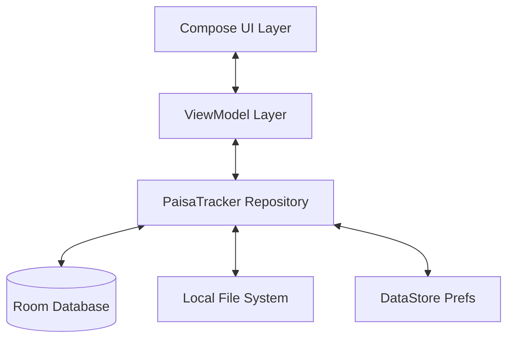

# PaisaTracker 💰

<p align="center">
  
</p>

<p align="center">
  <strong>Modern. Private. Comprehensive.</strong><br>
  A sophisticated personal finance ecosystem built with <b>Kotlin</b> and <b>Jetpack Compose</b>.
</p>

<p align="center">
  <a href="https://github.com/harshal20m/PaisaTracker/releases/latest">
    
  </a>
</p>

---

## 📱 Visual Showcase

> [!IMPORTANT]  
> Screenshots are currently being updated to reflect the latest UI overhaul.

The following areas define the PaisaTracker experience:

1.  **Project-Centric Dashboard**: Manage finances across multiple life areas (Home, Business, Travel).
2.  **Quick Access "Flap"**: A specialized utility drawer featuring a built-in calculator and quick notes.
3.  **Smart Budgeting**: Set monthly limits per category and track progress with visual indicators.
4.  **Salary Tracker**: Specialized logging for monthly income records.
5.  **Interactive Analytics**: Deep-dive insights with pie charts and spending trends.
6.  **Assets Gallery**: A centralized vault for receipt attachments and financial documents.
7.  **Data Management**: One-tap full system backups and CSV export/import.
8.  **Security Hub**: Multi-layered protection with Biometric and PIN authentication.

---

## ✨ Core Features

### 📂 **Advanced Organization**
- **Multi-Project System**: The only tracker that lets you isolate expenses into independent projects.
- **Hierarchical Categorization**: Categories belong to projects, keeping your "Work" expenses separate from "Personal".
- **Dynamic Emoji Support**: Fully customizable categories with a built-in emoji selection system.

### 🎛️ **The "Quick Access Flap"**
- **Built-in Calculator**: Perform quick calculations without leaving the app.
- **Financial Notes**: Jot down reminders or pending payment details in a dedicated notes tab.
- **Swipe Interface**: Access tools instantly with a modern gesture-based drawer.

### 💰 **Budgeting & Income**
- **Category Budgets**: Set strict limits and get visual warnings as you approach them.
- **Salary Logging**: Track your income history alongside your expenses for a complete financial picture.
- **Payment Methods**: Support for UPI (PhonePe, GPay, Paytm), Cash, and Cards.

### 📊 **Intelligence & Automation**
- **Rich Analytics**: Visual breakdown of spending by category, project, and payment method.
- **Smart Search**: Find any transaction instantly with global search capabilities.
- **Daily Reminders**: Intelligent notification system to ensure you never miss a log.

### 🛡️ **Privacy & Portability**
- **100% Offline**: Your data is yours. No cloud sync, no tracking, no leaks.
- **Biometric Lock**: Secure the entire app with fingerprint or face recognition.
- **Universal Backups**: Create a single ZIP containing your entire database and all receipt images.
- **CSV Portability**: Move your data to Excel/Google Sheets effortlessly.

---

## 🛠️ Tech Stack

- **Language**: [Kotlin](https://kotlinlang.org/) (Coroutines, Flow)
- **UI Framework**: [Jetpack Compose](https://developer.android.com/jetpack/compose) (Material 3)
- **Database**: [Room](https://developer.android.com/training/data-storage/room) (SQLite)
- **Architecture**: MVVM + Repository Pattern
- **Networking**: [Retrofit](https://square.github.io/retrofit/) (Used for Update Management)
- **Background Tasks**: [WorkManager](https://developer.android.com/topic/libraries/architecture/workmanager)
- **Local Storage**: [DataStore](https://developer.android.com/topic/libraries/architecture/datastore) (Preferences)
- **Widgets**: [Jetpack Glance](https://developer.android.com/jetpack/compose/glance) (Home Screen Widgets)
- **Security**: Android Biometric API

---

## 🏛️ Architecture



---

## 🚀 Getting Started

### **Build from Source**
1.  **Clone the repository**
    ```bash
    git clone https://github.com/harshal20m/PaisaTracker.git
    ```
2.  **Open in Android Studio Ladybug** (or newer).
3.  **Sync Gradle** and click **Run**.

---

## 👨‍💻 Author

**Harshal Mali**
- GitHub: [@harshal20m](https://github.com/harshal20m)

---

<p align="center">
  Made with ❤️ by Harshal Mali
</p>
